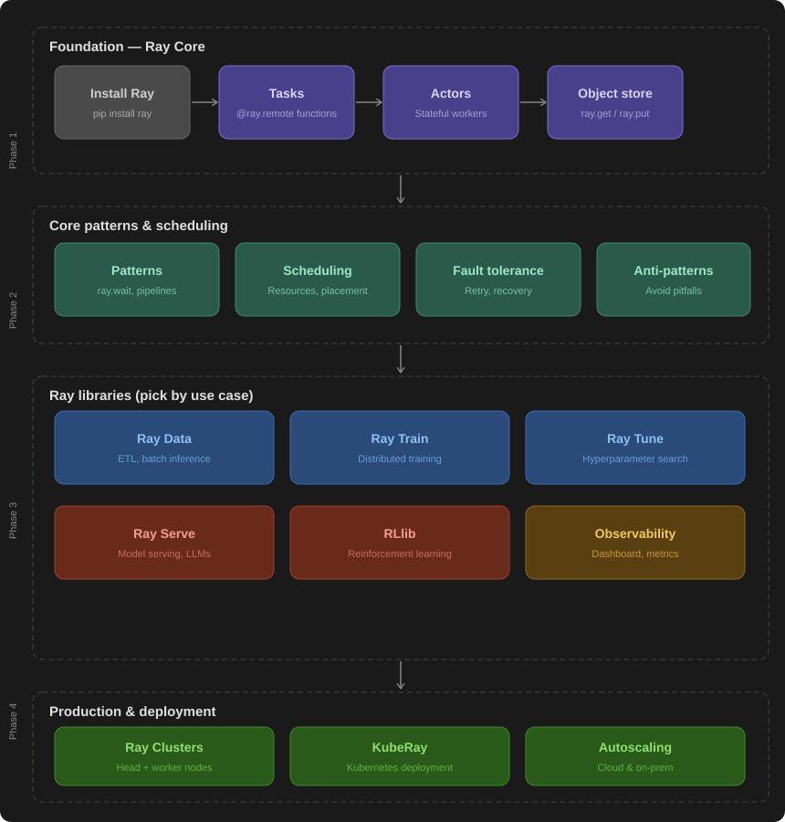

# Ray End-to-End Learning Path

> Structured deep-dive for Ray 2.55.1 — work through phases in order.

---

## Roadmap Overview

---

## Phase 1 — Foundation: Ray Core

Everything in Ray builds on three primitives. You cannot skip this phase.

| Concept | What it is | Key API |
|---|---|---|
| **Install Ray** | Set up your environment | `pip install ray` |
| **Tasks** | Stateless remote functions | `@ray.remote` decorator |
| **Actors** | Stateful distributed workers | `@ray.remote` class |
| **Object store** | Shared distributed memory | `ray.put()` / `ray.get()` |

**Docs:** https://docs.ray.io/en/latest/ray-core/walkthrough.html

---

## Phase 2 — Core Patterns & Scheduling

Once you understand the primitives, learn to use them well.

| Topic | Why it matters |
|---|---|
| **Patterns** | `ray.wait`, pipelines, nested tasks, generators |
| **Scheduling** | Resource hints, placement groups, co-location |
| **Fault tolerance** | Task/actor retry, node failure recovery |
| **Anti-patterns** | Avoid `ray.get` in loops, over-parallelization, large closures |

**Docs:** https://docs.ray.io/en/latest/ray-core/patterns/index.html

---

## Phase 3 — Ray Libraries

Pick the libraries relevant to your use case. You don't need all of them.

### Data & Training

| Library | Use case | Docs |
|---|---|---|
| **Ray Data** | Distributed ETL, batch inference, data preprocessing | https://docs.ray.io/en/latest/data/data.html |
| **Ray Train** | Distributed ML training (PyTorch, HuggingFace, XGBoost) | https://docs.ray.io/en/latest/train/train.html |
| **Ray Tune** | Hyperparameter search at scale | https://docs.ray.io/en/latest/tune/index.html |

### Serving & RL

| Library | Use case | Docs |
|---|---|---|
| **Ray Serve** | Model serving, LLM deployment, REST APIs | https://docs.ray.io/en/latest/serve/index.html |
| **RLlib** | Reinforcement learning, multi-agent environments | https://docs.ray.io/en/latest/rllib/index.html |

### Operations

| Topic | Use case | Docs |
|---|---|---|
| **Observability** | Ray Dashboard, metrics, tracing, logging | https://docs.ray.io/en/latest/ray-observability/getting-started.html |

---

## Phase 4 — Production & Deployment

Scale beyond a single machine.

| Topic | What you'll learn | Docs |
|---|---|---|
| **Ray Clusters** | Head node + worker nodes, cluster lifecycle | https://docs.ray.io/en/latest/cluster/getting-started.html |
| **KubeRay** | Deploying Ray on Kubernetes | https://docs.ray.io/en/latest/cluster/kubernetes/index.html |
| **Autoscaling** | Cloud autoscaling, on-prem resource management | https://docs.ray.io/en/latest/cluster/key-concepts.html |

---

## Learning Tips

- **Run every example yourself** — Ray is deeply hands-on
- **Open the Dashboard from day one** — `http://127.0.0.1:8265` after `ray.init()`
- **Read the anti-patterns early** — saves hours of debugging later
- **Official educational notebooks:** https://github.com/ray-project/ray-educational-materials
- **Full docs:** https://docs.ray.io/en/latest/index.html
